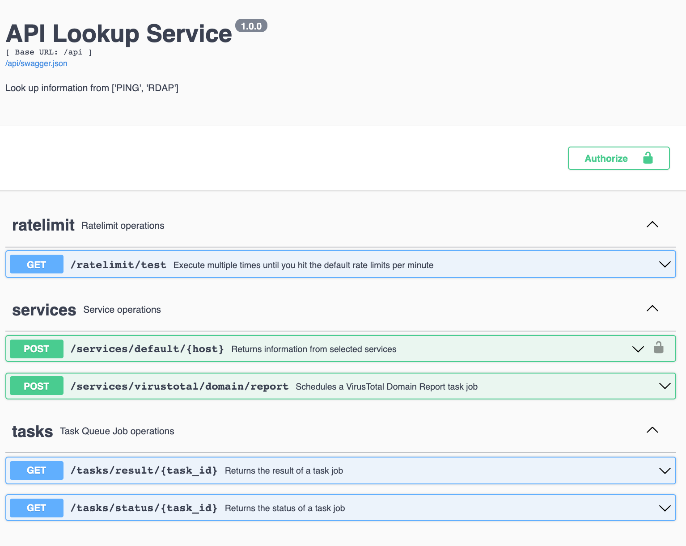

# API Lookup Service

This application leverages Python, Flask, Celery, RabbitMQ, MongoDB, and Docker to create a RESTful API Lookup Service.

## Goal

Integrate multiple services into a useful and timesaving workflow.

## Objective
Provide an API that takes a host (IP or domain) as input, gathers information from multiple sources using various workers, combine the results, and return a single payload.

## Extras
* Virustotal
* API Authentication
* Rate Limits
* Swagger Documentation
* Unit Testing
* Flower web monitoring for Celery workers and tasks
* RabbitMQ web monitoring and management
* PEP8 style guide

## Technology Stack

* Python 3.7
* Flask: web framework 
* Flask-RESTX: RESTful API Framework
* Pytest: Unit testing
* Celery: task/job queue - worker management
* RabbitMQ message broker/queue manager
* MongoDB: backend database
* Docker multi service

## Routes
> GET `/ratelimit/test`

Execute multiple times to test default rate limits
- 200 per day
- 50 per hour
- 5 per minute

```
curl -X 'GET' \
  'http://localhost:8000/api/services/test' \
  -H 'accept: application/json'
```

> POST `/services/default/{host}`

Gathers information from multiple sources. Process each service lookup action on different Celery task worker. Wait for each lookup to finish. Combine the results and return a single payload

Available services:

* Ping
* RDAP

**AUTHORIZATION REQUIRED**

Parameters:

- host: IP address or Domain Name
- payload: if none then lookup all services. 

Sample payload:
```
{
  "services": [
    "ping"
  ]
}
-------------------------
{
  "services": [
    "ping", "pong", RDAP"
  ]
}
-------------------------
{
  "services": []
}
```

```
curl -X 'POST' \
  'http://localhost:8000/api/services/default/8.8.8.8' \
  -H 'accept: application/json' \
  -H 'X-API-KEY: yourapitoken' \
  -H 'Content-Type: application/json' \
  -d '{
  "services": [
    "ping","pong","RDAP"
  ]
}'
```


> POST `/services/virustotal/domain/report`

Schedule a VirusTotal Domain Report task job

Parameters:

- apikey: VirusTotal API Key
- domain_name: A Domain name

Sample payload:

```
{
  "apikey": "xxxxx"
  "domain_name": "thedomainname.com"
}
```

```
curl -X 'POST' \
'http://localhost:8000/api/services/virustotal/domain/report' \
-H 'accept: application/json' \
-H 'Content-Type: application/json' \
-d '{
"apikey": "xxxxx",
"domain_name": "thedomainname.com"
}'
```

> GET `/api/tasks/status`

Returns the status of a task job

```
curl -X 'GET' \
'http://localhost:8000/api/tasks/status/c9857b91-6b41-4a49-bc30-b48a811965' \
-H 'accept: application/json'
```


> GET `/api/tasks/result`

Returns the result of a task job

```
curl -X 'GET' \
'http://localhost:8000/api/tasks/result/c9857b91-6b41-4a49-bc30-b48a811965' \
-H 'accept: application/json'
```

---



---

## Project Setup


```
$ git clone https://github.com/smilebhai/dev-api-app.git
$ cd dev-api-app
$ docker-compose up -d --build
$ docker-compose down
```

Once the build is complete, navigate to
* `API Swagger`: http://localhost:8000/api/docs
* `Flower Dashboard`: http://localhost:5555
* `Rabbit MQ Dashboard` : http://localhost:15672

## Unit Test

Unit test using ```pytest``` framework.

```
$ docker-compose exec api pytest -v
$ docker-compose exec tasks pytest -v
```

## Style Guide

Study Guide Enforcement using ```flake8```

`NOTE` For verbosity, include the flag `--v`

    $ pip install flake8
    $ flake8  path/to/your_code/app.py #check particular file
    $ flake8 path/to/your_project/ #check the entire project repo

## Project Structure

```
dev-api-app
├─ .env
├─ README.md
├─ api
│  ├─ .api-env
│  ├─ .dockerignore
│  ├─ Dockerfile
│  ├─ app.py
│  ├─ backend.py
│  ├─ pytest.ini
│  ├─ requirements.txt
│  ├─ routes
│  │  ├─ helpers.py
│  │  ├─ ratelimits.py
│  │  ├─ services.py
│  │  └─ tasks.py
│  ├─ settings.py
│  ├─ tests
│  │  └─ test_app.py
│  └─ tox.ini
├─ docker-compose.yml
├─ img
│  ├─ pytest-results.png
│  └─ swagger-ui.png
└─ tasks
   ├─ .dockerignore
   ├─ .tasks-env
   ├─ Dockerfile
   ├─ helpers.py
   ├─ pytest.ini
   ├─ requirements.txt
   ├─ settings.py
   ├─ tasks.py
   └─ tests
      ├─ run_tests_queue.py
      └─ test_tasks.py

```